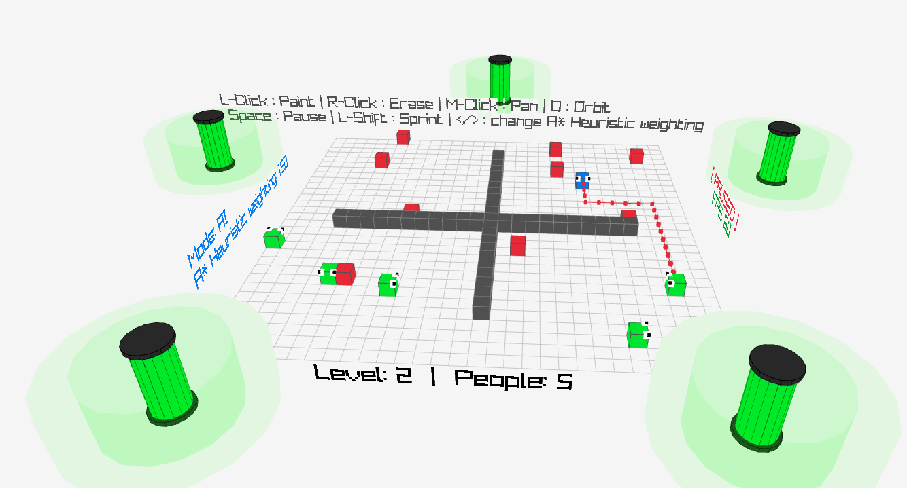

# Robot Save the People



A 3D grid-based puzzle game where you guide a robot to rescue people whilst avoiding mines and navigating procedurally generated levels. Features an integrated A* pathfinding visualisation and a custom 3D interface.

## Features

### Core Mechanics
- **State Machine Architecture:** Cleanly separates Menu, Gameplay, and Game Over logic.
- **Procedural Generation:** Levels are infinite and generated using the level number as a seed, ensuring every run of a specific level is identical.
- **Entity AI:**
  - **Mines & People:** Each have unique, randomised movement tendencies that remain consistent per level.
  - **Robot AI:** Implements a **Weighted A* Pathfinding Algorithm**.
- **Life System:** You have 5 lives, represented by 3D industrial battery cells surrounding the arena. Batteries deplete visually as you take damage.

### Visuals & Interface
- **3D World UI:** All HUD elements (score, controls, mode) are rendered as 3D text floating in the game world, strictly aligned to the grid edges.
- **Dynamic Text Orientation:** World text automatically flips to always face the camera, regardless of your viewing angle.
- **Path Visualisation:** When AI mode is active, the calculated path is drawn in real-time as a red line connecting grid nodes.
- **Character Design:** Custom primitive-based rendering for characters, including directional eyes that track movement direction.

### Data Persistence
- **Leaderboard System:** Scores (Name, Level, Duration) are saved to a local file (`leaderboard.txt`).
- **Score Sorting:** The Game Over screen automatically parses, sorts, and displays the top 5 runs based on Level reached (descending) and Duration (ascending).


## Controls

### General
- **M-Click (Hold + Drag):** Pan the camera horizontally.
- **O:** Toggle camera orbit mode (automatically rotates around the grid).
- **Space:** Pause / Unpause game.
- **Scroll Wheel:** Zoom in/out.

### Gameplay (Manual Mode)
- **WASD / Arrow Keys:** Move the robot relative to the camera view.
- **L-Shift (Hold):** Sprint (Robot moves twice as fast).
- **L-Click:** Paint walls on the grid.
- **R-Click:** Erase walls.

### AI & Debug
- **M:** Toggle AI Mode (Robot navigates automatically).
- **< / > (Shift + Comma/Period):** Decrease/Increase A* Heuristic weighting (Adjusts AI behaviour aggression).

## How to install dependencies

This project needs raylib.

Follow [this](https://github.com/raysan5/raylib/wiki/Working-on-GNU-Linux) guide for raylib installation. It is summarised here:

```bash
sudo apt install build-essential git
sudo apt install libasound2-dev libx11-dev libxrandr-dev libxi-dev libgl1-mesa-dev libglu1-mesa-dev libxcursor-dev libxinerama-dev libwayland-dev libxkbcommon-dev

git clone --depth 1 [https://github.com/raysan5/raylib.git](https://github.com/raysan5/raylib.git) raylib
cd raylib/src/
make PLATFORM=PLATFORM_DESKTOP # To make the static version.
make PLATFORM=PLATFORM_DESKTOP RAYLIB_LIBTYPE=SHARED # To make the dynamic shared version.

# install to standard directories
sudo make install # Static version.
sudo make install RAYLIB_LIBTYPE=SHARED # Dynamic shared version.
````

## How to run

**Compilation:**

```bash
make
```

**Running:**

```bash
./game
```
